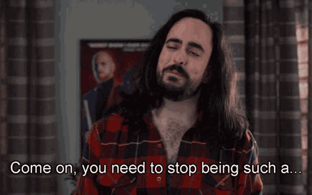
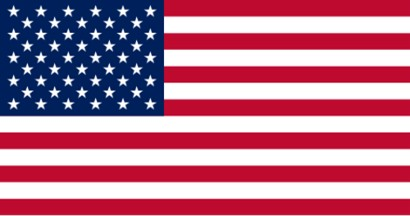

### On effort and design

#### Perfect is the enemy of good

So a while ago I was watching some international sporting event.

Ok that was a lie.

My brother was watching it and I happened to walk in while he was doing so.

I'm not big into sports, I admit.

However, behind the athlete was a digital wall where the flags of all participating countries floated by, and the swiss flag just happened to be in frame as well.

Like all other flags, it was a rectangle.

Most people wouldn’t see anything wrong with that. Neiter do I, to be honest. I’m not a big patriot. I like my country, but not to the level that I’d really care that our flag is supposed to be displayed as a square.

Well, ok it’s not even always supposed to be displayed as a square. It’s technically perfectly fine to display it as a rectangle in most situations.

So why even write about this?

#### Choices made and not made

It posed an interesting design question.

If we were to create a physical flag, a square flag would be saving a bit of fabric, and I’d argue it’s probably easier to make and get the proportions right. Depending on your production facilities, it’s probably just as easy to make it square as it is to make it rectangular. At most it’s 1 extra cut (or 2, if you want to keep something centered).

For a digital display however, you might run into some unexpected problems.

#### The pitfalls of edge cases

Displaying any single flag is pretty easy:

There you go, 'murica!

Swiss flag's easy too:

You might already see where this becomes tricky.

