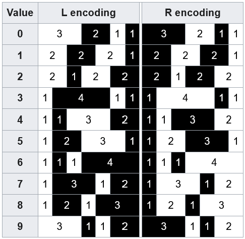
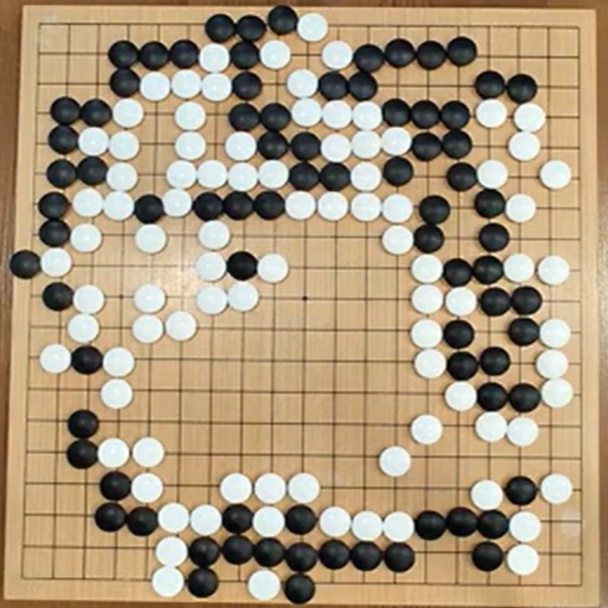

### Make your own QR codes!

This is a companion piece to the QR generator tool I have added to this site!

After you've read this, go and make some QR codes of your own.

<a href="/tools/qr" target="_blank">Link to tool</a>

### QR Codes are not scary

I mean, they're not entirely without danger, sure. Just like any link you'd get in an email, do not click (or scan) anything shady.

But any QR scanner worth it's salt will display the url you're about to open before opening it - always make sure it's one you marginally trust.

Anyways, I find that usually people are afraid of things they don't understand, so let's try to demystify QR codes.

#### What is a QR code anyways?

QR stands for "quick response". 

Unless that comes up as an answer on "Who wants to be a millionaire?" though, you can forget that again right away. It's not important and doesn't actually tell us anything useful.

What QR codes actually are, is the logical progression up from their 1-dimensional counterpart - the barcode.

#### Barcodes

While QR codes are very common nowadays, barcodes are certainly still ubiquitus. I'm sure I don't have to explain what a barcode **is**. 

Every product in a store has one. You or your cashier scans them. Product gets added to your bill.

They work on a very simple principle: You have a line. A thick line. You could call it a rectangle, I guess. But it's a line. Parts of that line are black, other parts are white.

Anyone who's ever had anything to do with programming or just computers in general might spot something familiar in that.

That's right, it's our old friend (foe?) [binary](https://en.wikipedia.org/wiki/Binary_number)!

Well, to be honest, it's not *exactly* binary...

You can't naively take a number in its binary representation and make a barcode out of it. The whitespace distribution would be totally whack.

**The most common standard** for barcodes, UPC, instead does the following:

</img>

For reasons too technical to get into, in what is **supposed to be** a tangent, each number was assigned a 7 bit sequence and its inverse (e.g. 0011001 & 1100110 for number "1").

A barcode is then constructed from these 7 bit segments + "guard patterns" on either side and the middle - these are the usually slightly longer bars you see in most barcodes.

They are always either Black-White-Black on the ends or White-Black-White-Black-White in the middle.

These guard patterns help the scanner to know where to start and stop reading. Since they're always the same, it's easy to look for them.

So for example, a barcode representing a 12 digit number is constructed like this:

- Start guard pattern (3 bars)
- 6 digits as the assigned 7 bit sequence (6 * 7 bars)
- Middle guard pattern (5 bars)
- 6 digits as the assigned inverse 7 bit sequence (6 * 7 bars)
- End guard pattern (3 bars)

For a total of 95 bars - that's all a barcode really is. 95 thin black or white bars.

To our human eyes, it's of course difficult to distinguish where one black or white bar ends and another begins, but for a scanner that's no problem.

As this most common type of barcode can encode 12 digits, it's obviously enough to assign a unique number to a lot of products (1 trillion products, to be exact).

That was enough for us for a long time.

#### Stepping up the dimensions

</img>

Well, [some Japanese dude](https://en.wikipedia.org/wiki/Masahiro_Hara) thought that just digits is boring.

The folklore is, that as he was thinking about the problem of how to encode more information in a space saving way, he got inspired by a Go board.

Such tales are usually apocryphal (like Newton and the apple), but as I don't see the claims overly aggrandized as they usually are, and Go is certainly popular in Japan, this one seems plausible to me.

Well, whether it's true or not, the new QR code standard resulting from his invention is certainly a big improvement over barcodes.

Let's just do some head math: If the one dimensional barcodes encoded 95 bits on a line, then in a square that's already 95^2^ bits!

That's a whooping 9025 bits of information.

With so much more *space* available to work with, of course the clever designers of the QR standrd 